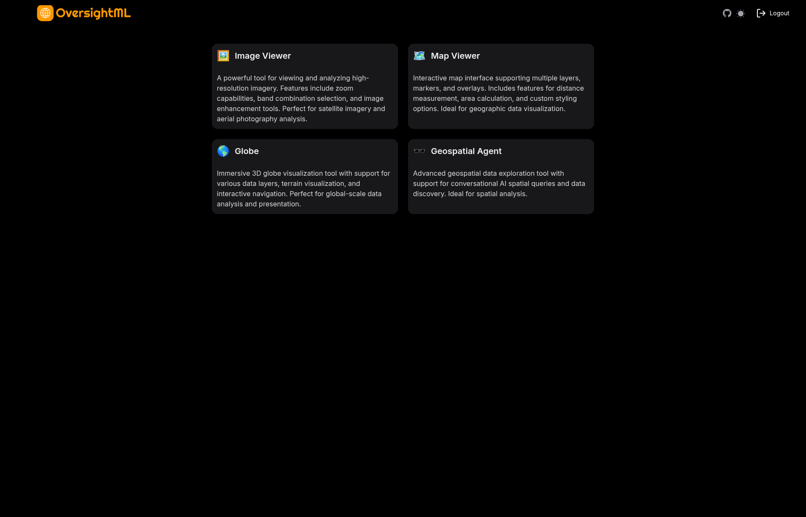
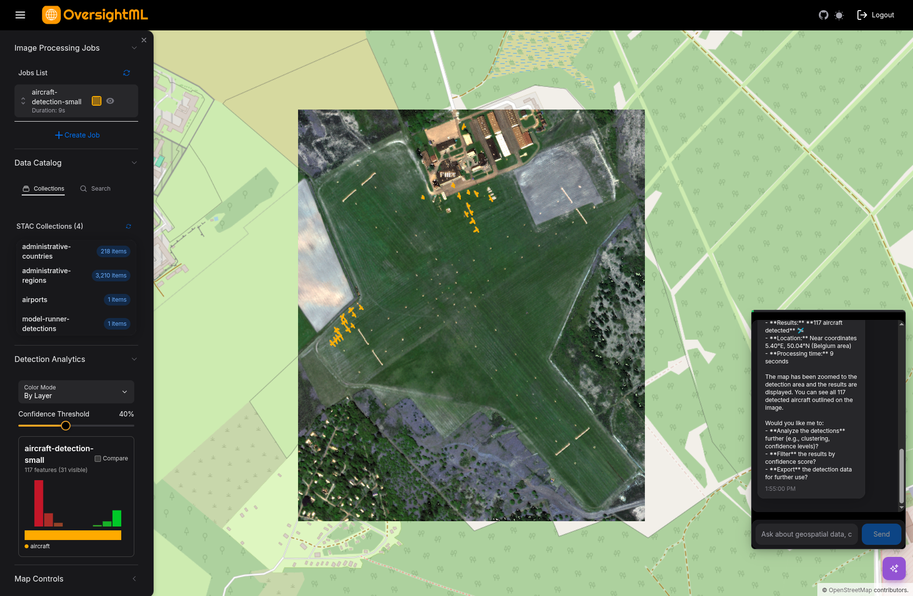
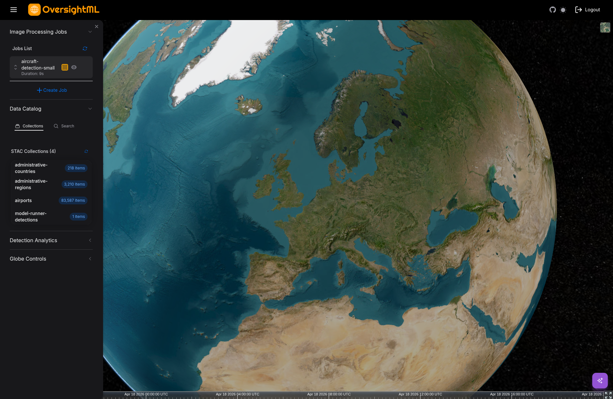

# OversightML Web Application

> **Pre-release** — This project is under active development. Expect breaking changes and limited support.

The OSML Web App is a reference application for testing, visualizing, and demonstrating [OversightML](https://github.com/aws-solutions-library-samples/guidance-for-processing-overhead-imagery-on-aws) components — including [Model Runner](https://github.com/awslabs/osml-model-runner), [Tile Server](https://github.com/awslabs/osml-tile-server), [Data Intake](https://github.com/awslabs/osml-data-intake), and [Geo Agents](https://github.com/awslabs/osml-geo-agents). It shows one way these components can be integrated into a full-stack geospatial application; the actual integration pattern will vary depending on your requirements.

A key design goal is the **agentic UI pattern**: a human operator and an AI agent (powered by AWS Bedrock and the Model Context Protocol) cooperatively exercise the application — the agent can search catalogs, submit processing jobs, manipulate map features, and control the viewport, while the human retains oversight and decision-making authority. This collaborative workflow accelerates common geospatial tasks that would otherwise require many manual steps.

For detailed architecture documentation, diagrams, and data-flow descriptions see [`docs/architecture/`](./docs/architecture/).

<p align="center">
  
</p>
<p align="center">
  
</p>
<p align="center">
  
</p>

## Architecture

The web app connects to two groups of services: backend services deployed by this CDK project, and OSML services that are deployed independently. The frontend accesses most OSML services (tile server, STAC catalog, geo agents, auth) directly — only the Model Runner API acts as a proxy to the upstream Model Runner pipeline.

```
┌─────────────────────────────────────────────────────────────────┐
│                    React Web Application                        │
│  ┌──────────────┐  ┌──────────────┐  ┌──────────────┐           │
│  │ Map Viewer   │  │ Globe Viewer │  │ Image Viewer │           │
│  │ (OpenLayers) │  │  (Cesium)    │  │              │           │
│  └──────────────┘  └──────────────┘  └──────────────┘           │
│  ┌──────────────────────────────────────────────────┐           │
│  │      Geospatial Agent (AI Chat + MCP Tools)      │           │
│  └──────────────────────────────────────────────────┘           │
└──────────┬──────────────────────────────────┬───────────────────┘
           │                                  │
           ▼                                  ▼
┌─────────────────────────────┐  ┌────────────────────────────────┐
│   Web App Backend Services  │  │         OSML Services          │
│                             │  │                                │
│  ┌───────────────────────┐  │  │  ┌──────────────────────────┐  │
│  │ WebApp Utility        │  │  │  │ Tile Server (Map Tiles)  │  │
│  │ (Lambda/FastAPI)      │  │  │  └──────────────────────────┘  │
│  │ - S3 Operations       │  │  │  ┌──────────────────────────┐  │
│  │ - Bedrock Chat        │  │  │  │ STAC Catalog (Data Index)│  │
│  │ - Quota Tracking      │  │  │  └──────────────────────────┘  │
│  └───────────────────────┘  │  │  ┌──────────────────────────┐  │
│  ┌───────────────────────┐  │  │  │ Model Runner (ML Pipeline│  │
│  │ Model Runner API ─────┼──┼──►  │  via Model Runner API)   │  │
│  │ (Lambda/FastAPI)      │  │  │  └──────────────────────────┘  │
│  └───────────────────────┘  │  │  ┌──────────────────────────┐  │
│  ┌───────────────────────┐  │  │  │ Geo Agents (MCP Server)  │  │
│  │ STAC Loader           │  │  │  └──────────────────────────┘  │
│  │ (ECS Fargate)         │  │  │  ┌──────────────────────────┐  │
│  └───────────────────────┘  │  │  │ Auth Server (Keycloak)   │  │
│  ┌───────────────────────┐  │  │  └──────────────────────────┘  │
│  │ JWT Authorizer        │  │  │                                │
│  │ (Lambda)              │  │  │                                │
│  └───────────────────────┘  │  │                                │
└─────────────────────────────┘  └────────────────────────────────┘
```

## Key Features

### Map Viewer
- Interactive 2D mapping with OpenLayers
- Multiple layer support and overlays
- STAC catalog integration for geospatial data discovery
- Feature selection and property inspection
- Custom styling and visualization options

### Globe Viewer
- Immersive 3D globe visualization using Cesium
- Multiple data layer support
- Interactive camera controls

### Image Viewer
- High-resolution imagery viewing and analysis
- Zoom and pan capabilities
- Band combination selection
- Image enhancement tools

### Geospatial Agent
- AI-powered conversational interface for spatial analysis
- Integration with AWS Bedrock (Claude models)
- Model Context Protocol (MCP) tool execution
- Local and remote MCP server support
- Tools for data catalog search, feature manipulation, viewport control, and geospatial operations
- Smart quota tracking and rate limiting

## Technology Stack

### Frontend
- **Framework**: Next.js (App Router)
- **UI Library**: HeroUI v2
- **Styling**: Tailwind CSS
- **State Management**: Redux Toolkit with Redux Persist
- **Authentication**: NextAuth.js with OIDC (Keycloak)
- **Mapping**: OpenLayers (2D), Cesium/Resium (3D)
- **AI Integration**: use-mcp (Model Context Protocol), AWS Bedrock Runtime
- **Type Safety**: TypeScript

### Backend (AWS Lambda)
- **Framework**: FastAPI (Python 3.13)
- **API Gateway**: AWS API Gateway with JWT authorization
- **Services**: WebApp Utility API, Model Runner API, JWT Authorizer
- **Data Models**: Pydantic
- **AWS SDK**: Boto3

### Infrastructure (AWS CDK)
- **Stacks**:
  - WebApp Stack (ALB + EC2 Auto Scaling Group)
  - WebApp Utility Services Stack (Lambda + API Gateway)
  - Model Runner API Stack (Lambda + API Gateway + DynamoDB)
  - STAC Loader Stack (ECS Fargate)
- **Networking**: VPC with public/private subnets
- **Authentication**: JWT validation with JWKS
- **Compliance**: CDK Nag for security validation

### Testing
- **Unit Tests**: Jest with React Testing Library
- **Coverage**: 80% threshold (62% for branches)
- **Backend Tests**: pytest with tox

## Prerequisites

- **Node.js** 24+ and npm
- **AWS CLI** configured with appropriate credentials
- **AWS CDK CLI**: `npm install -g aws-cdk`
- **Docker**: Required for CDK Lambda layer bundling
- **Python 3.13**: For Lambda development

> **Note**: See `package.json`, `cdk/package.json`, and Lambda function requirements for specific version requirements.

## Installation

1. **Clone the repository**:
   ```bash
   cd lib/osml-web-app
   ```

2. **Install dependencies**:
   ```bash
   npm install
   ```

3. **Configure environment variables**:
   ```bash
   cp .env.local.example .env.local
   # Edit .env.local with your service URLs and auth configuration
   ```

   See [`.env.local.example`](./.env.local.example) for all available variables.

4. **Generate NextAuth secret for local development**:
   ```bash
   openssl rand -base64 32
   ```

   Add the output to `.env.local` as `NEXTAUTH_SECRET`. For deployed environments, CDK auto-generates this secret in AWS Secrets Manager — you do not need to provide one in `deployment.json`.

## Development

### Run the development server:
```bash
npm run dev
```

Open [http://localhost:3000](http://localhost:3000) in your browser.

### Available Scripts

- `npm run dev` - Start development server
- `npm run build` - Build for production
- `npm run build:zip` - Build a standalone bundle and zip it for deployment (runs `next build` with `output: "standalone"` then includes Cesium and Next.js static assets)
- `npm start` - Start production server
- `npm run lint` - Run ESLint with auto-fix
- `npm test` - Run unit tests
- `npm run test:watch` - Run tests in watch mode
- `npm run test:coverage` - Generate coverage report

### State Management

The application uses Redux Toolkit with a modular slice-based architecture. See [`docs/architecture/06-web-application-architecture.md`](./docs/architecture/06-web-application-architecture.md) for the full state management documentation including slice organization, typed hooks, async thunks, and selector patterns.

### Project Structure

```
lib/osml-web-app/
├── src/
│   ├── app/                    # Next.js app router pages
│   │   ├── api/               # API routes (NextAuth)
│   │   ├── geo-agent/         # Geospatial agent page
│   │   ├── globe/             # 3D globe viewer
│   │   ├── image/             # Image viewer
│   │   └── map/               # 2D map viewer
│   ├── auth/                  # NextAuth configuration
│   ├── components/            # React components
│   │   ├── analytics/        # Detection analytics panel
│   │   ├── chat/             # Chat interface components
│   │   ├── data-catalog/     # STAC catalog components
│   │   ├── globe/            # Globe-specific components
│   │   ├── map/              # Map-specific components
│   │   ├── mcp/              # MCP server management
│   │   ├── modals/           # Job creation and config modals
│   │   ├── navigation/       # Navigation components
│   │   └── sidebars/         # Sidebar panels
│   ├── hooks/                # Custom React hooks
│   ├── mcp/                  # MCP implementation
│   │   └── local-server/     # Local MCP tools
│   ├── services/             # API service layer
│   ├── store/                # Redux store
│   │   ├── slices/          # Redux slices (feature state)
│   │   ├── selectors/       # Memoized selectors
│   │   ├── hooks.ts         # Typed Redux hooks
│   │   └── store.ts         # Store configuration
│   ├── styles/              # Global styles
│   ├── types/               # TypeScript types
│   └── utils/               # Utility functions
├── cdk/                      # AWS CDK infrastructure
│   ├── bin/                 # CDK app entry point
│   ├── lib/                 # CDK stacks and constructs
│   └── lambda/              # Lambda function code
│       ├── authorizer/              # JWT authorizer
│       ├── detectionBridgeTranslator/ # Detection result ingest
│       ├── geojsonIngestTranslator/ # GeoJSON data ingest
│       ├── lifecycleManager/        # EC2 lifecycle hooks
│       ├── modelRunnerApi/          # Model Runner API
│       ├── quotaCodesGenerator/     # Bedrock quota codes
│       ├── stacLoader/             # STAC data loader (MCP server)
│       └── webAppUtility/          # WebApp Utility API
├── cypress/                 # E2E tests
├── docs/architecture/       # Architecture documentation
├── public/                  # Static assets
└── package.json
```

## Deployment

The application is deployed using AWS CDK. See [cdk/README.md](./cdk/README.md) for detailed deployment instructions.

### Quick Deployment

1. **Configure deployment**:
   ```bash
   cd cdk
   cp bin/deployment/deployment.json.example bin/deployment/deployment.json
   # Edit deployment.json with your AWS account and configuration
   ```

2. **Install CDK dependencies**:
   ```bash
   npm install
   ```

3. **Deploy all stacks**:
   ```bash
   npm run deploy:all
   ```

### Deployment Architecture

The CDK deployment creates:
- **VPC**: Optimized networking with public/private subnets
- **ALB + EC2**: Web application hosting with Auto Scaling
- **API Gateway**: RESTful APIs with JWT authorization
- **Lambda Functions**: Backend API handlers
- **ECS Fargate**: STAC Loader MCP server
- **DynamoDB**: Job status tracking
- **CloudWatch**: Logging and monitoring

### Runtime Configuration

The Next.js artifact is environment-agnostic — service URLs, the Bedrock model ID, and other client-visible settings are read from the EC2 instance environment at server boot rather than baked into the bundle.

- **Source of truth**: PM2 ecosystem `env` block (set by the EC2 user-data script in `cdk/lib/constructs/web-ui-construct.ts`).
- **Server**: `readRuntimeConfigFromEnv()` reads the values from `process.env`.
- **Client**: the root layout serializes the runtime config and emits `<script>window.__OSML_CONFIG__=...</script>` into the SSR'd HTML head; `siteConfig` reads it at module load.
- **Local dev**: same shape, but the values come from `.env.local` via `next dev`.

Server-only secrets (`NEXTAUTH_SECRET`, `OIDC_AUTHORITY`) are read directly by the code that needs them and are never injected into the page HTML.

## Testing

### Unit Tests
```bash
npm test                    # Run all tests
npm run test:watch         # Watch mode
npm run test:coverage      # With coverage report
```

### Backend Tests
```bash
cd cdk/lambda/webAppUtility
tox                        # Run all Python tests
```

### STAC Loader Integration Tests

The STAC Loader has end-to-end integration tests that run as a Lambda function against the deployed MCP server. The integration test stack is deployed by default when `deployIntegrationTests` is `true` in `cdk/bin/deployment/deployment.json`.

To invoke the tests after deployment:
```bash
./scripts/stac_loader_integ.sh
```

The script invokes the test Lambda, polls CloudWatch for results, and reports pass/fail. You can specify a custom project name if yours differs from the default:
```bash
./scripts/stac_loader_integ.sh --project-name MyProject
```

## Configuration

### Authentication
The app uses NextAuth.js with OIDC (OpenID Connect) for authentication. Configure your Keycloak realm with:
- Client ID matching `NEXTAUTH_CLIENT_ID`
- Redirect URI: `{NEXTAUTH_URL}/api/auth/callback/oidc`
- Public client (PKCE flow)

### MCP Servers
Configure MCP servers in the Geospatial Agent interface:
- **Local Tools**: Built-in tools for data catalog, features, and viewport
- **Remote Servers**: Connect to external MCP servers (e.g., osml-geo-agents)

### Bedrock Models
Available models are defined in `cdk/lambda/webAppUtility/app.py` and can be filtered at deploy time via the `bedrockModels.enabledModels` list in `deployment.json`. The app includes automatic quota tracking and rate limiting.

## Integration with OSML Services

This application integrates with the following OSML services:

- **osml-tile-server**: Provides map tile imagery
- **osml-data-intake**: STAC catalog for geospatial data indexing
- **osml-model-runner**: ML pipeline for object detection
- **osml-geo-agents**: MCP server for geospatial operations

### Uploading GeoJSON Test Data to the STAC Catalog

The web app includes a data catalog ingest bucket (`web-app-data-intake-{account_id}`) that feeds into the `osml-data-intake` pipeline. When a `.geojson` file is uploaded to this bucket, a translator Lambda converts the S3 event into an `SNSRequest` and publishes it to the `data-catalog-intake` SNS topic. The official `osml-data-intake` GeoJSON processor then handles downloading, STAC item creation, validation, and ingestion into OpenSearch.

**Collection naming**: The collection ID is derived from the parent directory in the S3 key. For example, uploading to `uploads/airports/data.geojson` creates items in the `airports` collection. Files at the root level default to `OSML`, and the intake processor will further refine the collection name from the key path.

**Feature deconstruction**: By default, each GeoJSON file becomes a single STAC item. To split a FeatureCollection into individual STAC items per feature, you can either:
- Set the `DECONSTRUCT_FEATURE_COLLECTIONS` environment variable to `true` on the `data-catalog-intake` Lambda (applies globally)
- Add an S3 object tag `DECONSTRUCT_FEATURE_COLLECTIONS=true` to the uploaded file (per-file override)

**Deleting collections**: The STAC API (stac-fastapi-opensearch) supports `DELETE /collections/{collection_id}`, which removes the collection and all its items. The web app's MCP agent exposes this as the `delete_stac_collection` tool. STAC items and collections can be removed through conversation with the AI Agent.
