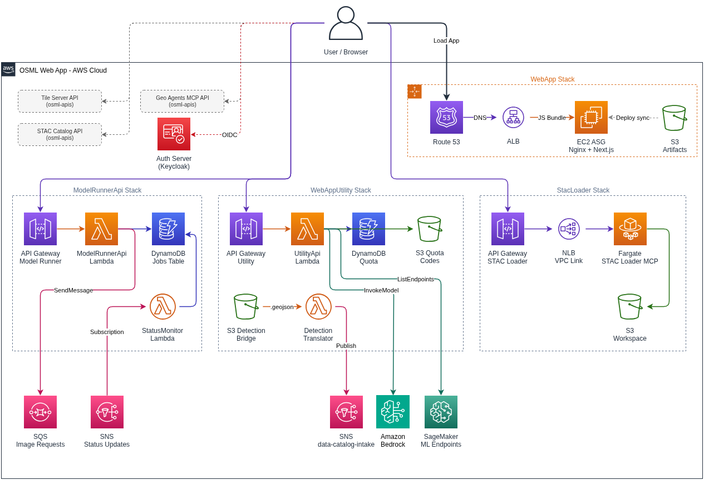
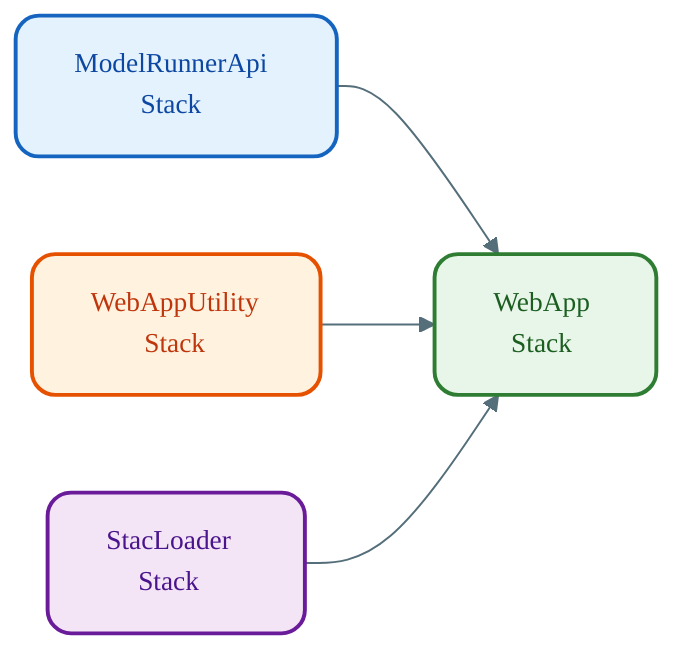

# Infrastructure Overview

High-level view of the 4 CDK stacks deployed by `osml-web-app` and their relationships to external OSML components.

## AWS Architecture Diagram

> The editable source is at [`drawio/01-infrastructure-overview.xml`](./drawio/01-infrastructure-overview.xml).

## Stack Deployment Order

## Stack Summary

| Stack | Key Resources | Purpose |
|-------|--------------|---------|
| **ModelRunnerApi** | API Gateway, 2 Lambdas, DynamoDB | Proxy image processing jobs to Model Runner |
| **WebAppUtilityServices** | API Gateway, 4 Lambdas, DynamoDB, 3 S3 Buckets | S3 browsing, Bedrock AI, quota tracking, data ingest |
| **StacLoader** | API Gateway, ECS Fargate, ALB, NLB, VPC Link, S3 | STAC data loading MCP server |
| **WebApp** | ALB, ASG (2–4 EC2), S3, 2 Lambdas | Next.js frontend hosting |

## Cross-Stack Data Flow

| From | To | Data |
|------|----|------|
| ModelRunnerApi | WebApp | API Gateway URL for job management |
| WebAppUtility | WebApp | API Gateway URL for utility services |
| WebAppUtility | WebApp | Detection Bridge bucket name |
| StacLoader | WebApp | MCP server URL |
| All API stacks | WebApp | URLs injected as Next.js environment variables at build time |
