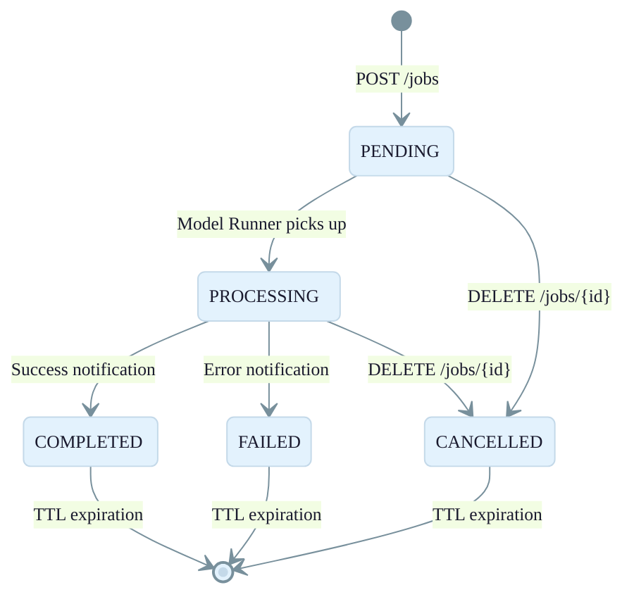

# ModelRunnerApi Stack

Detailed architecture of the `OSML-WebApp-ModelRunnerApi` stack. This stack provides a REST API that proxies image processing requests to the OSML Model Runner and tracks job lifecycle via DynamoDB.

See the [Infrastructure Overview](./01-infrastructure-overview.md) for the full AWS architecture diagram showing this stack in context.

## API Endpoints

The FastAPI application exposes these routes (proxied through API Gateway):

| Method | Path | Description |
|--------|------|-------------|
| `POST` | `/jobs` | Submit a new image processing job |
| `GET` | `/jobs` | List all jobs (with status filter) |
| `GET` | `/jobs/{job_id}` | Get job details |
| `DELETE` | `/jobs/{job_id}` | Cancel / delete a job |

## Job Lifecycle

## IAM Permissions

| Role | Permissions |
|------|------------|
| **ApiRole** | DynamoDB (R/W Jobs Table), SQS (SendMessage), S3 (ListBucket, DeleteObject), CloudWatch Logs, VPC networking |
| **ApiStatusMonitorRole** | DynamoDB (R/W Jobs Table), CloudWatch Logs |
| **AuthorizerFunction** | CloudWatch Logs, VPC networking |

## Configuration

| Parameter | Source | Description |
|-----------|--------|-------------|
| `modelRunnerImageRequestQueueArn` | deployment.json | ARN of the Model Runner SQS queue |
| `modelRunnerStatusTopicArn` | deployment.json | ARN of the Model Runner SNS status topic |
| `auth.authority` | deployment.json | OIDC issuer URL for JWT validation |
| `auth.audience` | deployment.json | Expected JWT audience claim |
| `hostedZone` | deployment.json | Route53 hosted zone for custom domain |
| `domainName` | deployment.json | Custom domain name for the API |
