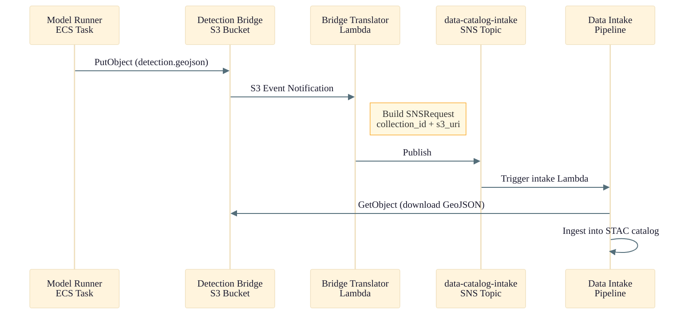
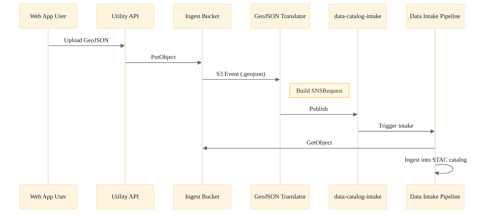

# WebAppUtility Services Stack

Detailed architecture of the `OSML-WebApp-WebAppUtilityServices` stack. This stack provides utility APIs for S3 browsing, Amazon Bedrock AI model invocation, SageMaker endpoint discovery, quota management, and data catalog ingestion bridges.

See the [Infrastructure Overview](./01-infrastructure-overview.md) for the full AWS architecture diagram showing this stack in context.

## API Endpoints

| Method | Path | Description |
|--------|------|-------------|
| `GET` | `/s3/buckets` | List accessible S3 buckets |
| `GET` | `/s3/buckets/{name}/objects` | List objects in a bucket |
| `GET` | `/s3/presigned-url` | Generate presigned URL for object access |
| `DELETE` | `/s3/objects` | Delete an S3 object |
| `POST` | `/bedrock/invoke` | Invoke a Bedrock foundation model |
| `GET` | `/bedrock/models` | List available Bedrock models |
| `GET` | `/sagemaker/endpoints` | List SageMaker endpoints |
| `GET` | `/quotas/usage` | Get current quota usage for a model |
| `GET` | `/quotas/limits` | Get quota limits for Bedrock models |

## Detection Bridge Flow

## Data Catalog Ingest Flow

## S3 Bucket Policies

| Bucket | Policy | Principal Condition |
|--------|--------|-------------------|
| **Detection Bridge** | `s3:PutObject` | Role ARN matching `*model-runner*` |
| **Detection Bridge** | `s3:GetObject` | Role ARN matching `*data-catalog-intake*` |
| **Data Catalog Ingest** | `s3:GetObject` | Role ARN matching `*data-catalog-intake*` |

## IAM Permissions

| Lambda | Key Permissions |
|--------|----------------|
| **UtilityApi** | S3 (List/Get/Delete/CORS), Bedrock (Invoke/List), SageMaker (ListEndpoints), Service Quotas, DynamoDB (R/W), CloudWatch, VPC |
| **QuotaCodesGenerator** | Bedrock (ListFoundationModels), Service Quotas (ListServiceQuotas), S3 (Write) |
| **GeojsonIngestTranslator** | SNS (Publish to intake topic) |
| **DetectionBridgeTranslator** | SNS (Publish), S3 (Read bridge bucket) |
