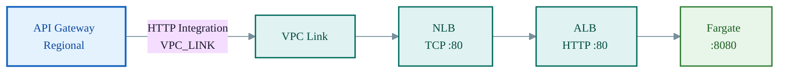

# StacLoader Stack

Detailed architecture of the `OSML-WebApp-StacLoader` stack. This stack deploys an ECS Fargate service running a Model Context Protocol (MCP) server for loading STAC data, fronted by API Gateway with JWT authentication.

See the [Infrastructure Overview](./01-infrastructure-overview.md) for the full AWS architecture diagram showing this stack in context.

## Network Path Detail

API Gateway cannot directly integrate with an ALB — it needs a VPC Link targeting an NLB:

## MCP Protocol Headers

| Header | Direction | Purpose |
|--------|-----------|---------|
| `mcp-session-id` | Request | MCP session tracking |
| `mcp-protocol-version` | Request | Protocol version negotiation |
| `Mcp-Session-Id` | Response (exposed) | Session ID returned to client |
| `Authorization` | Request | JWT bearer token passthrough |

## Container Environment

| Variable | Value | Description |
|----------|-------|-------------|
| `WORKSPACE_BUCKET_NAME` | Bucket name | S3 workspace for STAC items |
| `AWS_DEFAULT_REGION` | Stack region | AWS region for SDK calls |
| `DATA_CATALOG_BASE_URL` | STAC catalog URL | Base URL for auth token passthrough |

## S3 Lifecycle Rules

| Prefix | Expiration | Purpose |
|--------|-----------|---------|
| `stac/` | 7 days (configurable) | Temporary STAC item storage |
| `datasets/` | 7 days (configurable) | Temporary dataset storage |

When using a shared workspace bucket (via `workspaceBucketName` config), the `LifecycleMerger` Custom Resource Lambda safely merges lifecycle rules without overwriting existing rules on the bucket.
