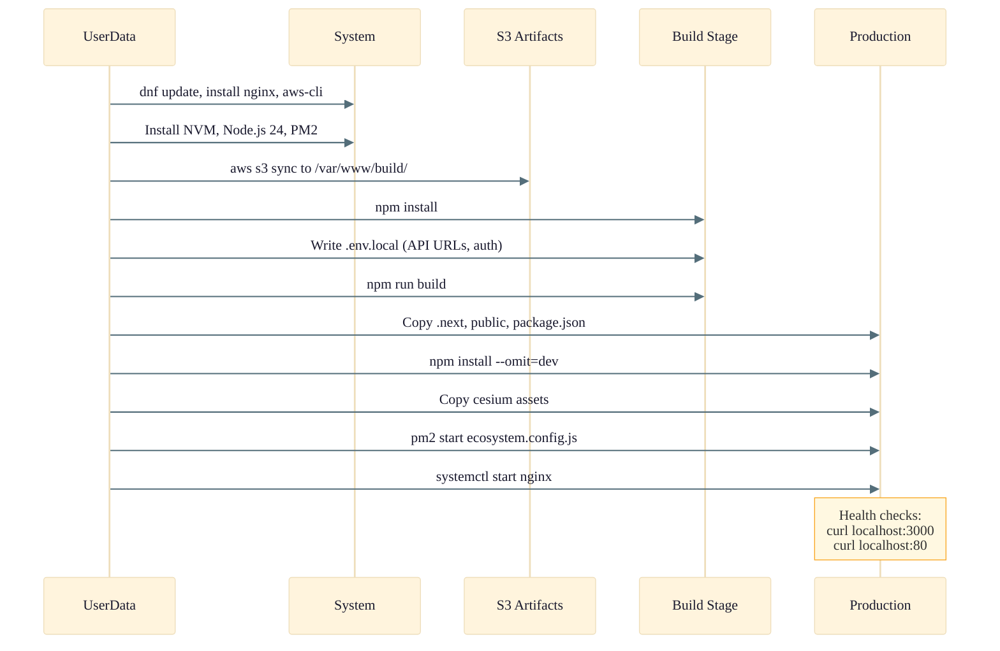

# WebApp Stack

Detailed architecture of the `OSML-WebApp-WebApp` stack. This stack hosts the Next.js frontend application on EC2 instances behind an Application Load Balancer, with automated build and deployment via S3 artifacts.

See the [Infrastructure Overview](./01-infrastructure-overview.md) for the full AWS architecture diagram showing this stack in context.

## EC2 Bootstrap Sequence

## Environment Variables (Build Time)

| Variable | Source | Description |
|----------|--------|-------------|
| `NEXT_PUBLIC_TILE_SERVER_URL` | deployment.json | Tile Server base URL |
| `NEXT_PUBLIC_STAC_CATALOG_URL` | deployment.json | STAC Catalog API URL |
| `NEXT_PUBLIC_STAC_LOADER_MCP_URL` | StacLoader stack | STAC Loader MCP server URL |
| `NEXT_PUBLIC_UTILITY_API_URL` | WebAppUtility stack | Utility API Gateway URL |
| `NEXT_PUBLIC_MODEL_RUNNER_API_URL` | ModelRunnerApi stack | Model Runner API Gateway URL |
| `NEXT_PUBLIC_GEO_AGENTS_MCP_URL` | deployment.json | Geo Agents MCP server URL |
| `NEXT_PUBLIC_DETECTION_BRIDGE_BUCKET` | WebAppUtility stack | Detection bridge S3 bucket name |
| `NEXT_PUBLIC_OIDC_AUTHORITY` | deployment.json | OIDC authority URL |
| `NEXTAUTH_URL` | deployment.json | NextAuth callback URL |
| `NEXTAUTH_CLIENT_ID` | deployment.json | OIDC client ID |
| `NEXTAUTH_SECRET` | deployment.json | NextAuth session secret |

## Deployment Modes

| Mode | Config | Behavior |
|------|--------|----------|
| **Build from Source** | `buildFromSource: true` (default) | CDK bundles Next.js locally via `npm ci && npm run build:zip`, uploads to S3 |
| **Build from URL** | `buildFromSource: false` + `artifactUrl` | Custom Resource Lambda downloads pre-built `build.zip` from URL to S3 |

## Instance Refresh

On every CDK deployment, a Custom Resource triggers an ASG Instance Refresh:
- **MinHealthyPercentage**: 50% (rolling update)
- **InstanceWarmup**: 120 seconds
- **Checkpoints**: 20%, 50%, 100%
- Lambda polls for completion (up to 13 minutes)
