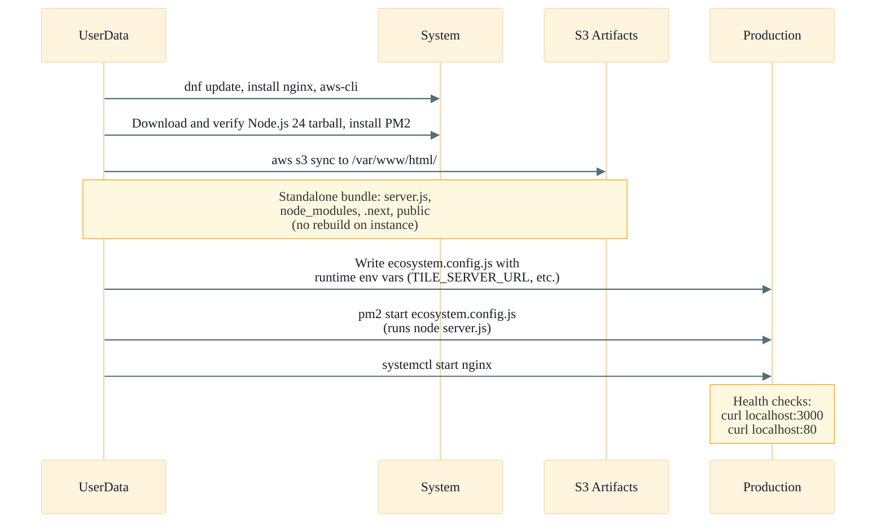
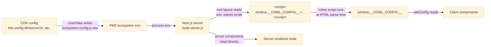

# WebApp Stack

Detailed architecture of the `OSML-WebApp-WebApp` stack. This stack hosts the Next.js frontend application on EC2 instances behind an Application Load Balancer, with automated build and deployment via S3 artifacts.

See the [Infrastructure Overview](./01-infrastructure-overview.md) for the full AWS architecture diagram showing this stack in context.

## EC2 Bootstrap Sequence

## Runtime Configuration

The Next.js build artifact is environment-agnostic: deployment-specific values are injected at server boot via `process.env` and exposed to the browser through the root layout.

| Variable | Source | Visibility | Description |
|----------|--------|------------|-------------|
| `TILE_SERVER_URL` | deployment.json | client + server | Tile Server base URL |
| `STAC_CATALOG_URL` | deployment.json | client + server | STAC Catalog API URL |
| `STAC_LOADER_MCP_URL` | StacLoader stack | client + server | STAC Loader MCP server URL |
| `UTILITY_API_URL` | WebAppUtility stack | client + server | Utility API Gateway URL |
| `MODEL_RUNNER_API_URL` | ModelRunnerApi stack | client + server | Model Runner API Gateway URL |
| `GEO_AGENTS_MCP_URL` | deployment.json | client + server | Geo Agents MCP server URL |
| `DETECTION_BRIDGE_BUCKET` | WebAppUtility stack | client + server | Detection bridge S3 bucket name |
| `KINESIS_STREAM_NAME` | deployment.json | client + server | Kinesis stream for detections |
| `OIDC_AUTHORITY` | deployment.json | server only | OIDC authority URL (NextAuth) |
| `NEXTAUTH_URL` | deployment.json | server only | NextAuth callback URL |
| `NEXTAUTH_CLIENT_ID` | deployment.json | server only | OIDC client ID |
| `NEXTAUTH_SECRET` | AWS Secrets Manager | server only | NextAuth session secret (generated by CDK, fetched by EC2 user-data at boot) |

"Visibility" denotes whether a value is exposed in the browser via `window.__OSML_CONFIG__`. Server-only values are read directly from `process.env` by NextAuth and never appear in the page HTML.

## Deployment Modes

| Mode | Config | Behavior |
|------|--------|----------|
| **Build from Source** | `buildFromSource: true` (default) | CDK bundles Next.js locally via `npm ci && npm run build:zip`, which produces a standalone bundle, uploads it to S3 |
| **Build from URL** | `buildFromSource: false` + `artifactUrl` | Custom Resource Lambda downloads a pre-built standalone `build.zip` from the URL to S3 |

In both modes the artifact contents are the same: a self-contained Next.js standalone bundle (`server.js`, `.next/`, `node_modules/`, `public/`). The instance launches by syncing this bundle from S3 and running `node server.js` under PM2 — no `npm install` or `next build` happens on the instance.

## Instance Refresh

On every CDK deployment, a Custom Resource triggers an ASG Instance Refresh
using the launch-before-terminate strategy:
- **MinHealthyPercentage**: 100% — all existing instances remain in service
  until replacements are healthy
- **MaxHealthyPercentage**: 200% — the ASG may temporarily run at 2x desired
  capacity while replacements warm up
- **InstanceWarmup**: 120 seconds
- Lambda polls for completion (up to 13 minutes)

Trade-off: brief doubling of EC2 cost during deploy in exchange for zero
served-traffic gap and roughly half the refresh duration vs. a rolling
update. No checkpoint pauses or alarm-driven halts are configured, since
this is a demo application and a brief broken-deploy window is acceptable.
