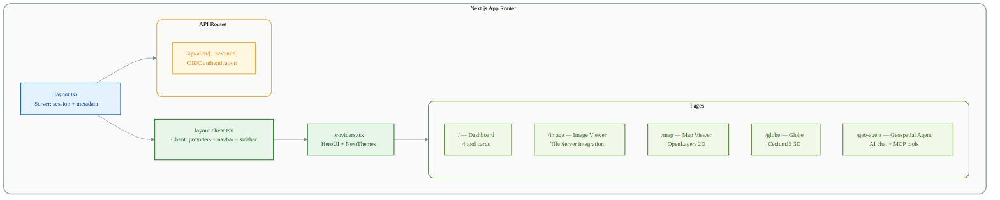
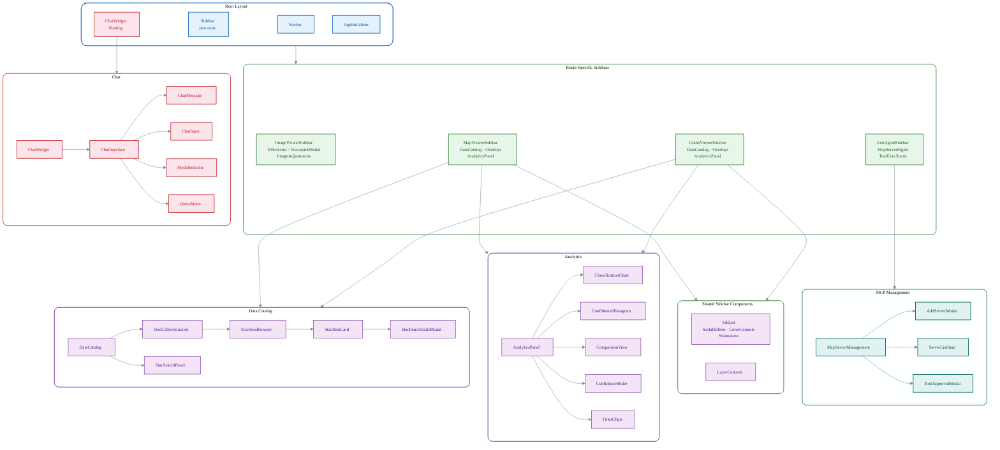
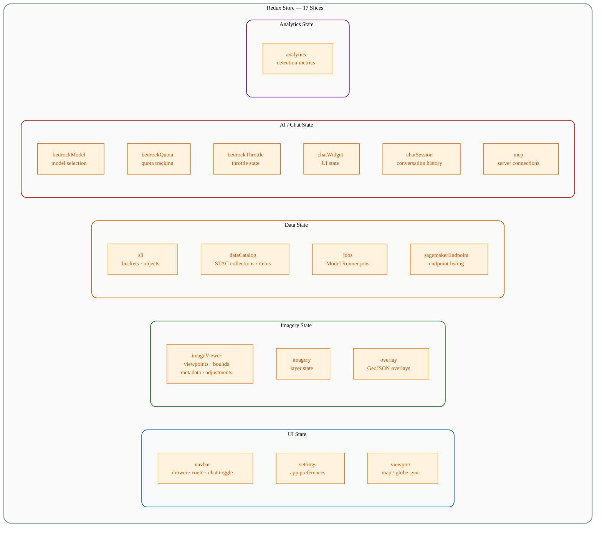
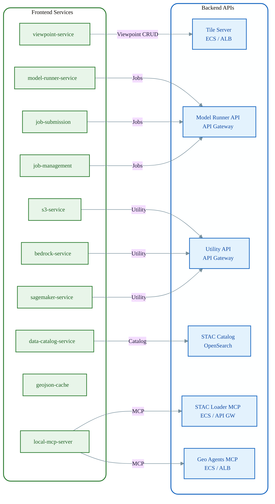
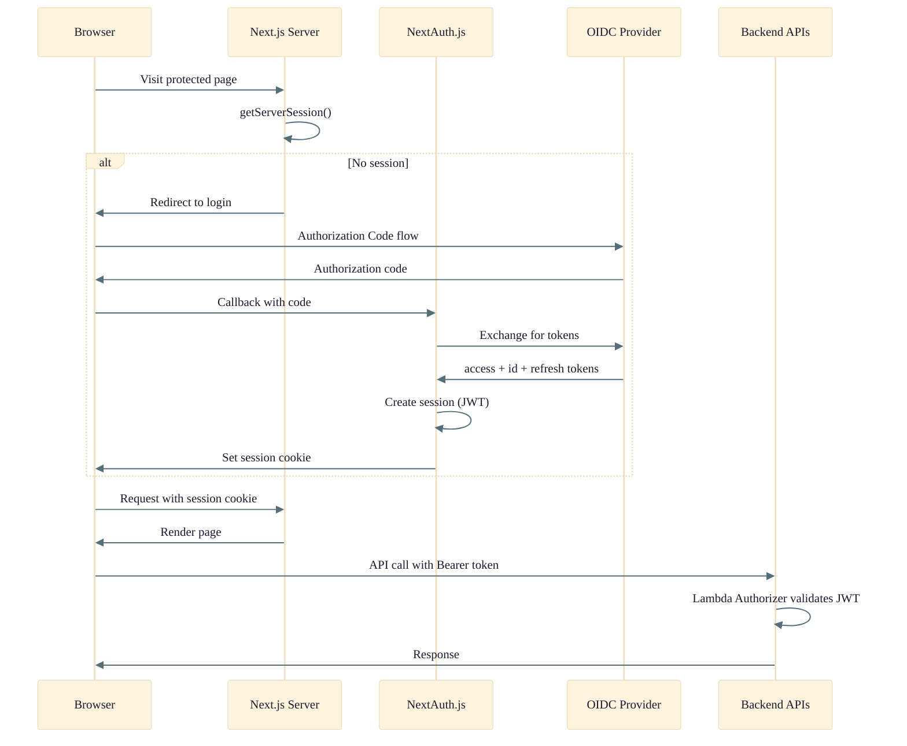

# Web Application Architecture

Detailed architecture of the OSML Web App frontend — a Next.js 16 application with React 19, Redux Toolkit state management, and integrations with multiple backend services.

## Technology Stack

| Layer | Technology |
|-------|-----------|
| Framework | Next.js 16 (App Router) |
| UI Library | React 19 |
| Component Library | HeroUI |
| Styling | Tailwind CSS 4 |
| State Management | Redux Toolkit |
| 2D Maps | OpenLayers 10 + ol-ext + ol-stac |
| 3D Globe | CesiumJS 1.136 + Resium |
| Authentication | NextAuth.js (OIDC) |
| AI Chat | Amazon Bedrock (via Utility API) |
| Agent Protocol | Model Context Protocol (MCP) |
| Testing | Jest 30 + Cypress 15 |

## Page / Route Structure

## Component Hierarchy

## State Management (Redux Toolkit)

## Services Layer

## Authentication Flow

## Key Hooks

| Hook | Purpose |
|------|---------|
| `use-chat-generation` | Orchestrates Bedrock model invocation with tool calling |
| `use-mcp` | Manages MCP server connections and tool discovery |
| `use-local-mcp-server` | Runs the in-browser MCP server |
| `use-tool-chain` | Executes multi-step tool call chains |
| `use-overlay-layer-data` | Loads GeoJSON overlays onto map / globe |
| `use-quota-usage` | Tracks Bedrock quota consumption |
| `use-smart-quota-polling` | Adaptive polling for quota updates |
| `use-stac-item-visibility` | Controls STAC item display on map |
| `use-viewpoint-warming` | Pre-warms tile server viewpoints |
| `use-viewport-sync` | Synchronizes 2D map and 3D globe viewports |
