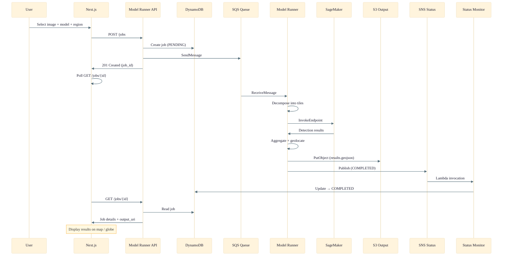
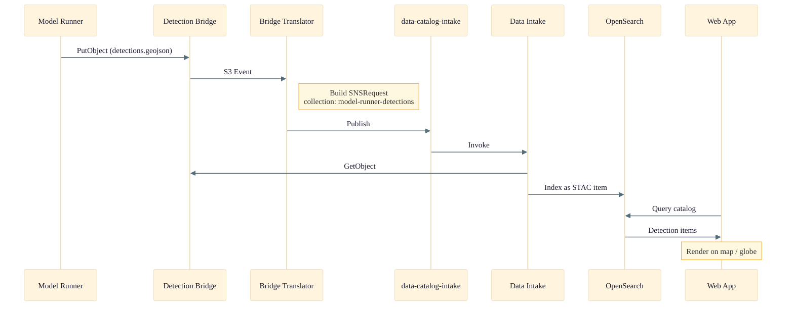
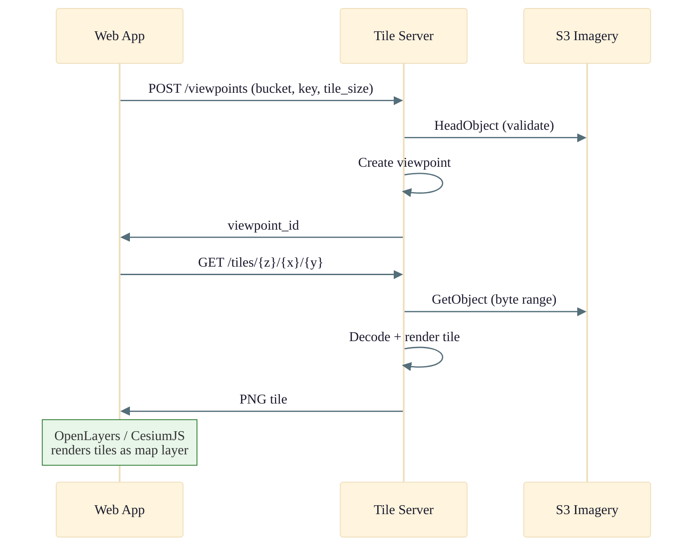
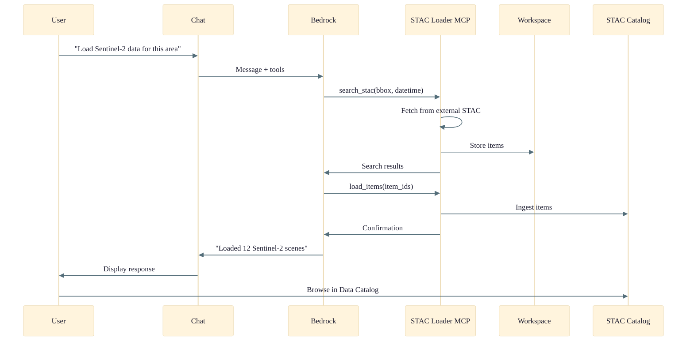
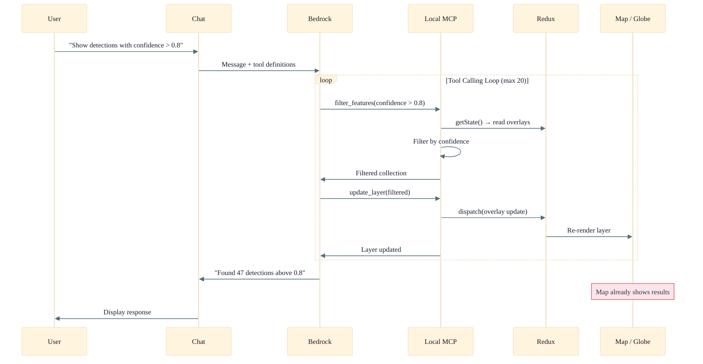
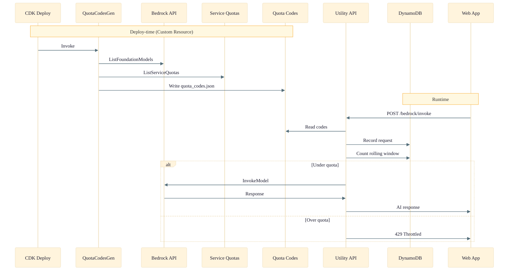

# Data Flow

End-to-end data flows through the OSML Web App, from imagery ingestion to visualization and AI-assisted analysis.

## Image Processing Flow

When a user submits an image for ML processing, the web app sends a job request through the Model Runner API. The API creates a job record in DynamoDB and enqueues an image processing request to SQS. The Model Runner ECS service picks up the message, decomposes the large geospatial image into tiles, sends each tile batch to a SageMaker endpoint for inference, then aggregates the detection results into a geolocated GeoJSON feature collection. Once complete, it writes the results to S3 and publishes a status update to SNS. A Status Monitor Lambda subscribes to that topic and updates the DynamoDB job record. Meanwhile, the web app polls the job status and, once complete, fetches the results and renders them as overlays on the map or globe.

## Detection Bridge Flow

After the Model Runner completes a job, its detection results need to be indexed in the STAC catalog so they're discoverable through the Data Catalog UI. The Model Runner writes detection GeoJSON to the Detection Bridge S3 bucket. An S3 event notification triggers the Detection Bridge Translator Lambda, which constructs an SNSRequest message (specifying the collection ID and S3 URI) and publishes it to the `data-catalog-intake` SNS topic. The Data Intake pipeline picks up the message, downloads the GeoJSON from S3, and indexes it as a STAC item in OpenSearch. The web app can then query the catalog and render the detections on the map or globe.

## Tile Serving Flow

The Tile Server provides on-demand map tiles from large geospatial imagery stored in S3. The web app first creates a "viewpoint" by sending the S3 bucket, object key, and desired tile size. The Tile Server validates the image exists, registers the viewpoint, and returns an ID. The web app then requests individual tiles using standard z/x/y slippy map coordinates. For each tile request, the Tile Server reads the relevant byte range from S3, decodes the imagery, renders the tile as a PNG, and returns it. OpenLayers (2D map) and CesiumJS (3D globe) consume these tiles as standard map layers.

## STAC Data Loading Flow

The STAC Loader enables AI-driven data discovery and ingestion through the chat interface. When a user asks the Geospatial Agent to load data for a specific area, the chat sends the request to Amazon Bedrock along with the available MCP tools. Bedrock plans a multi-step action: first calling `search_stac` on the STAC Loader MCP server to find matching items from external STAC catalogs, then calling `load_items` to ingest the selected items into the local STAC catalog backed by OpenSearch. The MCP server stores intermediate results in its S3 workspace bucket. Once loading is complete, the user can browse the newly ingested data through the Data Catalog sidebar.

## AI Chat with Tool Calling

The Geospatial Agent uses Amazon Bedrock with tool calling to interact directly with the web app's UI state. When a user sends a natural language request, the chat interface forwards it to Bedrock along with the definitions of all available tools (26 local tools plus remote MCP server tools). Bedrock plans and executes a sequence of tool calls — each one routed to the in-browser Local MCP Server, which reads from and dispatches actions to the Redux store. React components subscribed to the affected state slices re-render immediately, so the user sees the map update in real time as the AI works through its tool chain. The loop continues until Bedrock has no more tool calls to make, at which point it returns a natural language summary.

## Quota Management Flow

Bedrock model invocation is subject to AWS Service Quotas rate limits. The quota management system has two phases. At deploy time, a Custom Resource Lambda queries the Bedrock and Service Quotas APIs to build a mapping of model IDs to their quota codes and limits, then writes this as a JSON file to S3. At runtime, when the Utility API receives a Bedrock invocation request, it reads the quota codes from S3, records the request timestamp in a DynamoDB rolling window table, and checks whether the current request count exceeds the quota limit. If under quota, it forwards the request to Bedrock and returns the response. If over quota, it returns a 429 Throttled response with a retry-after interval, and the chat UI displays a throttle countdown to the user.

