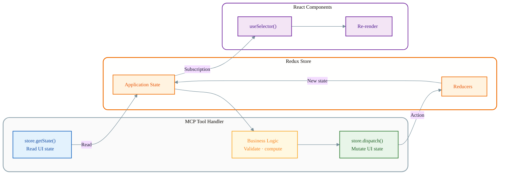
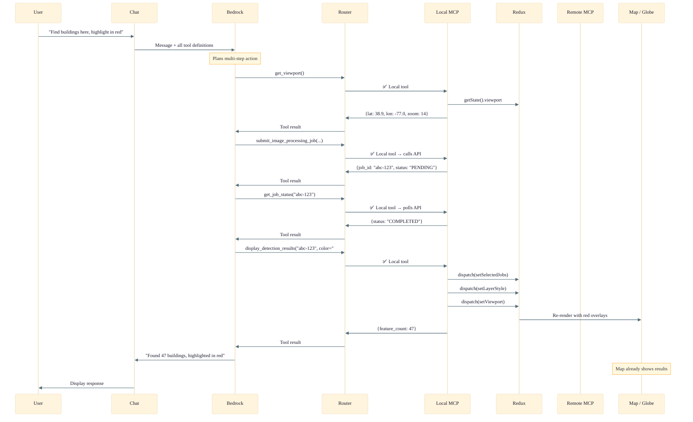
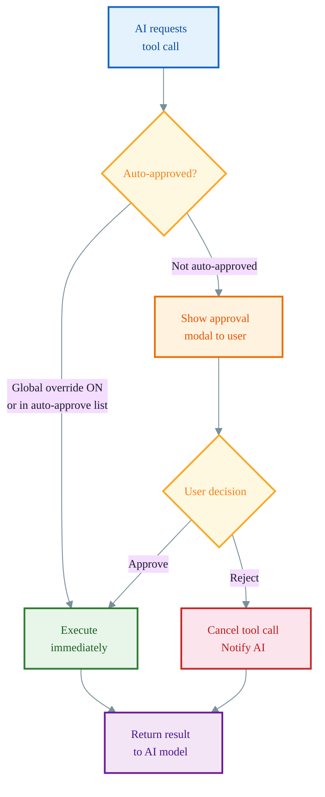

# Agentic UI: In-Browser MCP Server Pattern

This document describes the architectural pattern used by the OSML Web App's Geospatial Agent, where an AI model interacts directly with the frontend application state through an in-browser Model Context Protocol (MCP) server.

The standard MCP architecture has a client application sending tool calls to a remote server over HTTP/SSE, where the server executes operations against backend resources and returns results. The OSML Web App inverts this: it runs an MCP server inside the browser that exposes the application's Redux store as a tool interface. When Amazon Bedrock returns tool calls, the frontend routes them to this local server, which dispatches Redux actions and reads state — the same state management layer that React components use for rendering. The AI model becomes a peer of the human user, capable of performing the same actions: navigating the map, drawing features, submitting ML jobs, toggling layers, and filtering analytics. The user sees the UI update in real time as the AI acts.

Critically, this pattern gives the AI shared situational awareness with the user. Because the local MCP server can read the Redux store, the AI knows what the user is currently looking at — the viewport coordinates, which layers are visible, what detection results are loaded, and what filters are applied. This means the AI can answer contextual questions like "What am I looking at?" or "How many detections are in this area?" without the user needing to describe their current view. The AI and the human operator share the same view of the application state.

## Architecture Overview

```mermaid
%%{init: {'theme': 'base', 'themeVariables': { 'primaryTextColor': '#1a1a2e', 'lineColor': '#78909c', 'fontFamily': 'Inter, Segoe UI, sans-serif', 'fontSize': '12px' }}}%%
flowchart TB
    subgraph browser["Browser"]
        subgraph react["React Components"]
            MAP["Map View<br/>OpenLayers"]:::ui
            GLOBE["Globe View<br/>CesiumJS"]:::ui
            SIDEBAR["Sidebar"]:::ui
            ANALYTICS["Analytics"]:::ui
            CHAT["Chat"]:::chat_node
        end

        subgraph redux["Redux Store"]
            VP["viewport"]:::slice
            OVR["overlay"]:::slice
            JOBS["jobs"]:::slice
            IMG["imagery"]:::slice
            AN["analytics"]:::slice
            DC["dataCatalog"]:::slice
        end

        subgraph local_mcp["Local MCP Server"]
            REGISTRY["Tool Registry<br/>26 tools"]:::mcp_node
            VP_T["viewport-tools"]:::tool
            FEAT_T["feature-tools"]:::tool
            LAYER_T["layer-tools"]:::tool
            MR_T["model-runner-tools"]:::tool
            DC_T["data-catalog-tools"]:::tool
            AN_T["analytics-tools"]:::tool
        end

        subgraph router["Tool Chain Orchestrator"]
            ROUTE["Tool Router"]:::router_node
            APPROVE["Approval Modal"]:::router_node
        end
    end

    subgraph cloud["AWS Cloud"]
        BEDROCK["Amazon Bedrock<br/>Claude"]:::bedrock
        subgraph remote["Remote MCP Servers"]
            STAC_MCP["STAC Loader MCP"]:::remote_svc
            GEO_MCP["Geo Agents MCP"]:::remote_svc
        end
    end

    USER((("User"))):::user

    %% ── User interaction ──
    USER -->|Chat message| CHAT
    USER -->|Click · pan · zoom| react

    %% ── Chat ↔ Bedrock ──
    CHAT -->|Messages + tool defs| BEDROCK
    BEDROCK -->|"Response + tool_use"| CHAT

    %% ── Tool routing ──
    CHAT -->|Tool calls| ROUTE
    ROUTE -->|"Local tool?"| REGISTRY
    ROUTE -->|"Remote tool?"| remote

    %% ── Local MCP ↔ Redux ──
    REGISTRY --> VP_T & FEAT_T & LAYER_T & MR_T & DC_T & AN_T
    VP_T -->|"dispatch(setViewport)"| VP
    FEAT_T -->|"dispatch(addFeature)"| OVR
    LAYER_T -->|"dispatch(setVisibility)"| OVR
    MR_T -->|"dispatch(setSelectedJobs)"| JOBS
    AN_T -->|"dispatch(setColorMode)"| AN

    VP_T -.->|"getState()"| VP
    LAYER_T -.->|"getState()"| OVR
    AN_T -.->|"getState()"| AN

    %% ── Redux → React ──
    VP -->|useSelector| MAP & GLOBE
    OVR -->|useSelector| MAP & GLOBE
    JOBS -->|useSelector| SIDEBAR
    AN -->|useSelector| ANALYTICS

    %% ── Approval ──
    ROUTE -.->|"Needs approval?"| APPROVE

    %% ── Class definitions ──
    classDef user fill:#fafafa,stroke:#546e7a,stroke-width:2px,color:#37474f
    classDef ui fill:#e8f5e9,stroke:#2e7d32,stroke-width:1.5px,color:#1b5e20
    classDef slice fill:#fff3e0,stroke:#ef6c00,stroke-width:1px,color:#e65100
    classDef chat_node fill:#fce4ec,stroke:#c62828,stroke-width:1.5px,color:#b71c1c
    classDef mcp_node fill:#e3f2fd,stroke:#1565c0,stroke-width:2px,color:#0d47a1
    classDef tool fill:#e1f5fe,stroke:#0277bd,stroke-width:1px,color:#01579b
    classDef router_node fill:#f3e5f5,stroke:#6a1b9a,stroke-width:1.5px,color:#4a148c
    classDef bedrock fill:#fce4ec,stroke:#c62828,stroke-width:2px,color:#b71c1c
    classDef remote_svc fill:#e0f2f1,stroke:#00695c,stroke-width:1.5px,color:#004d40

    style browser fill:#fafafa,stroke:#90a4ae,stroke-width:2px,rx:20
    style react fill:#e8f5e908,stroke:#2e7d32,stroke-width:1.5px,rx:12
    style redux fill:#fff3e008,stroke:#ef6c00,stroke-width:2px,rx:12
    style local_mcp fill:#e3f2fd08,stroke:#1565c0,stroke-width:2px,rx:12
    style router fill:#f3e5f508,stroke:#6a1b9a,stroke-width:1.5px,rx:12
    style cloud fill:#fafafa,stroke:#90a4ae,stroke-width:1.5px,stroke-dasharray:6 3,rx:16
    style remote fill:#e0f2f108,stroke:#00695c,stroke-width:1.5px,rx:12
```



## The Key Mechanism: Redux Store as Tool Interface

Each local MCP tool receives the Redux `Store` instance and can both read state and dispatch actions:



### Concrete Example: `zoom_to_location`

```typescript
handler: (args, store) => {
    // 1. Read args from AI model
    const { latitude, longitude, scale } = args;

    // 2. Compute derived values
    const zoom = getZoomForScale(scale || "city");
    const extent = calculateExtentFromCenter(latitude, longitude, zoom);

    // 3. Dispatch Redux action — map and globe both react
    store.dispatch(setViewport({
        latitude, longitude, zoom, extent,
        updatedBy: "agent"  // ← distinguishes AI from user actions
    }));

    // 4. Return result to AI model for reasoning
    return { success: true, viewport: { latitude, longitude, zoom, extent } };
}
```

When this executes: Redux updates → OpenLayers map and CesiumJS globe re-render → user sees the map animate to the new location → AI receives confirmation and can chain more tool calls.

## Multi-Step Tool Chain Example

This example shows how a single natural language request — "Find buildings here, highlight in red" — becomes a chain of four tool calls that the AI model plans and executes autonomously. The model first reads the current viewport to understand what the user is looking at, then submits an image processing job targeting that area, polls until the job completes, and finally displays the detection results with the requested styling. Each tool call either reads from or writes to the Redux store, and the map updates in real time as the AI progresses through the chain. The user sees buildings appear on the map before the AI even finishes composing its text response.



## Tool Approval System



## The 26 Local Tools

| Category | Tool | Reads | Writes | API |
|----------|------|:-----:|:------:|:---:|
| **Viewport** | `get_viewport` | ✅ | | |
| | `zoom_to_location` | | ✅ | |
| **Features** | `draw_feature` | | ✅ | |
| | `get_layers` | ✅ | | |
| | `delete_layer` | ✅ | ✅ | |
| | `clear_layers` | ✅ | ✅ | |
| **Layers** | `list_overlay_layers` | ✅ | | |
| | `set_layer_visibility` | ✅ | ✅ | |
| | `toggle_layer_visibility` | ✅ | ✅ | |
| | `set_group_visibility` | | ✅ | |
| | `reorder_layers` | ✅ | ✅ | |
| | `style_layer` | ✅ | ✅ | |
| **Model Runner** | `list_model_endpoints` | | | ✅ |
| | `list_available_images` | | | ✅ |
| | `submit_image_processing_job` | | ✅ | ✅ |
| | `get_job_status` | | | ✅ |
| | `list_image_processing_jobs` | | | ✅ |
| | `display_detection_results` | ✅ | ✅ | ✅ |
| | `delete_image_processing_job` | ✅ | ✅ | ✅ |
| **Data Catalog** | `list_stac_collections` | | | ✅ |
| | `search_stac_items` | | | ✅ |
| | `delete_stac_item` | | | ✅ |
| | `delete_stac_collection` | | | ✅ |
| **Analytics** | `get_detection_analytics` | ✅ | | |
| | `set_analytics_display` | ✅ | ✅ | |
| | `filter_detections` | ✅ | ✅ | |

## Design Principles

### 1. AI as a Redux Peer
The AI dispatches the same Redux actions as React components. No separate "AI command" layer — the AI operates through the same state interface as the UI.

### 2. `updatedBy: "agent"` Provenance
AI-dispatched actions include `updatedBy: "agent"`, letting components distinguish AI-initiated changes (animate smoothly) from user-initiated ones (instant update).

### 3. Read-Before-Write
Tools that modify state first read current state to validate inputs. `set_layer_visibility` checks the layer exists and returns `auto_zoom_enabled` so the AI knows whether a separate zoom call is needed. Read-only tools like `get_viewport`, `get_layers`, `list_overlay_layers`, and `get_detection_analytics` give the AI full awareness of what the user is currently seeing — enabling contextual responses without the user needing to describe their view.

### 4. Optimistic Updates with Rollback
Destructive operations like `delete_image_processing_job` snapshot state, dispatch optimistic removal, call the backend, and restore the snapshot on failure.

### 5. Hybrid Local + Remote
The tool router transparently handles both local (in-browser Redux) and remote (HTTP to MCP servers) tool calls. The AI sees a unified catalog.

### 6. Human-in-the-Loop
The approval system lets users configure which tools auto-execute and which require explicit approval, maintaining oversight over AI actions.

## Comparison with Standard Patterns

| Aspect | Standard MCP | OSML Agentic UI |
|--------|-------------|-----------------|
| Server location | Remote (HTTP/SSE) | In-browser (same process) |
| State access | Backend databases / APIs | Frontend Redux store |
| Latency | Network round-trip | Synchronous (sub-ms) |
| Effect | Backend side effects | Immediate UI updates |
| User visibility | Results returned as text | User sees UI change in real time |
| Tool count | Varies | 26 local + remote servers |
| State consistency | Eventual | Immediate (synchronous dispatch) |
